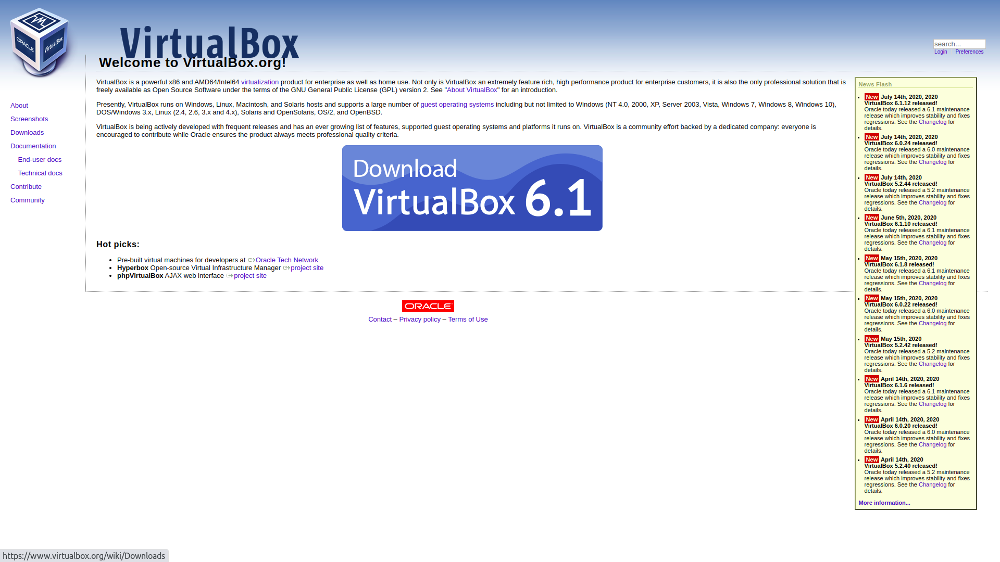
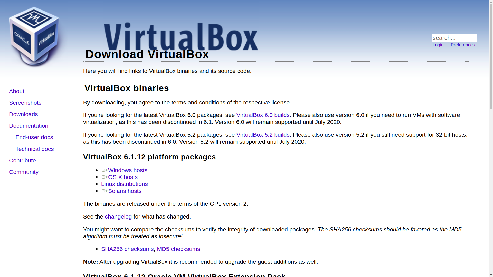
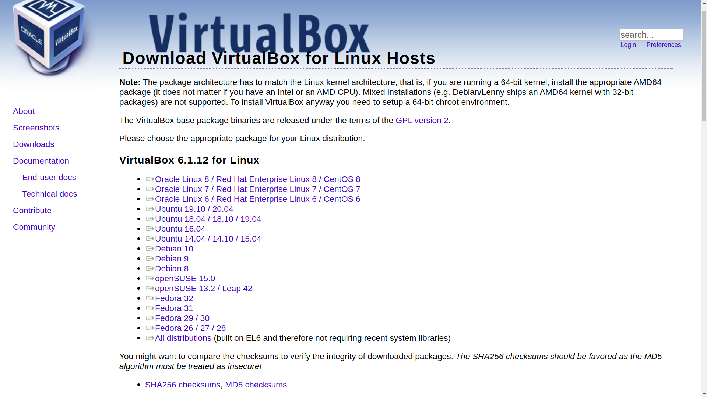
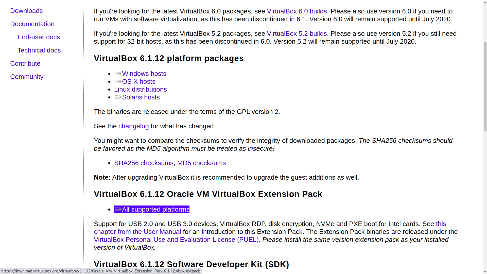

## Getting Started

Welcome to the Module 1 of setting up vm ssh using virtualbox. We will expand this guide in future with multiple modules.

## Requirements

The list of requirements are as follows:

1. Virtualbox
2. Ubuntu ISO
3. ssh-server
4. ssh-client
5. Internet to install packages (maybe if required.)

## Installing Virtualbox

To install virtualbox,

1. let's visit [https://virtualbox.org](https://virtualbox.org)
2. Choose latest Virtualbox version
3. Select your operating system in downloads
4. Download the installation binary for your os.
5. Install the binary on your os.
6. Install the virtualbox extensions pack.

The Images for the above instructions are:

<figure>
    
    <figcaption>Virtualbox.org home page</figcaption>
</figure>

<figure>
    
    <figcaption>virtualbox.org Select your operating system webpage</figcaption>
</figure>

<figure>
    
    <figcaption>Virtualbox.org choose installation package webpage </figcaption>
</figure>

<figure>
    
    <figcaption>Virtualbox.org extension pack webpage.</figcaption>
</figure>

## Required Files

| Filename       | Description                                                              |
| -------------- | ------------------------------------------------------------------------ |
| virtualbox.deb | Installation binary package for virtualbox on linux debian based systems |
| ubuntu.iso     | Bootable installation image of ubuntu os                                 |

## Next Steps

We are not done yet. We will continue in next module.
